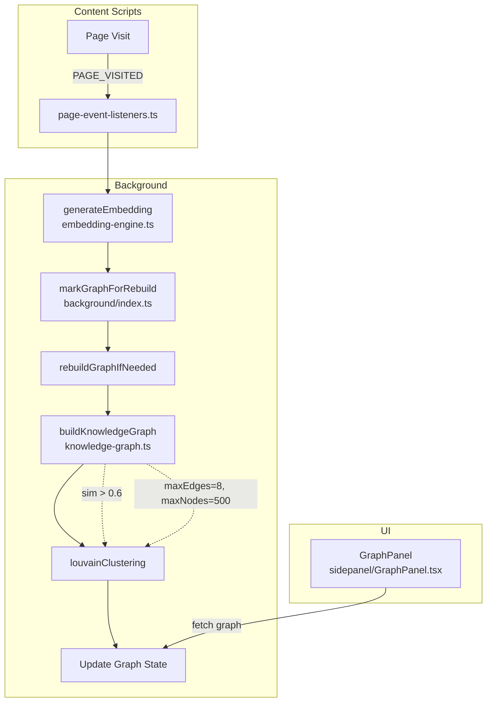
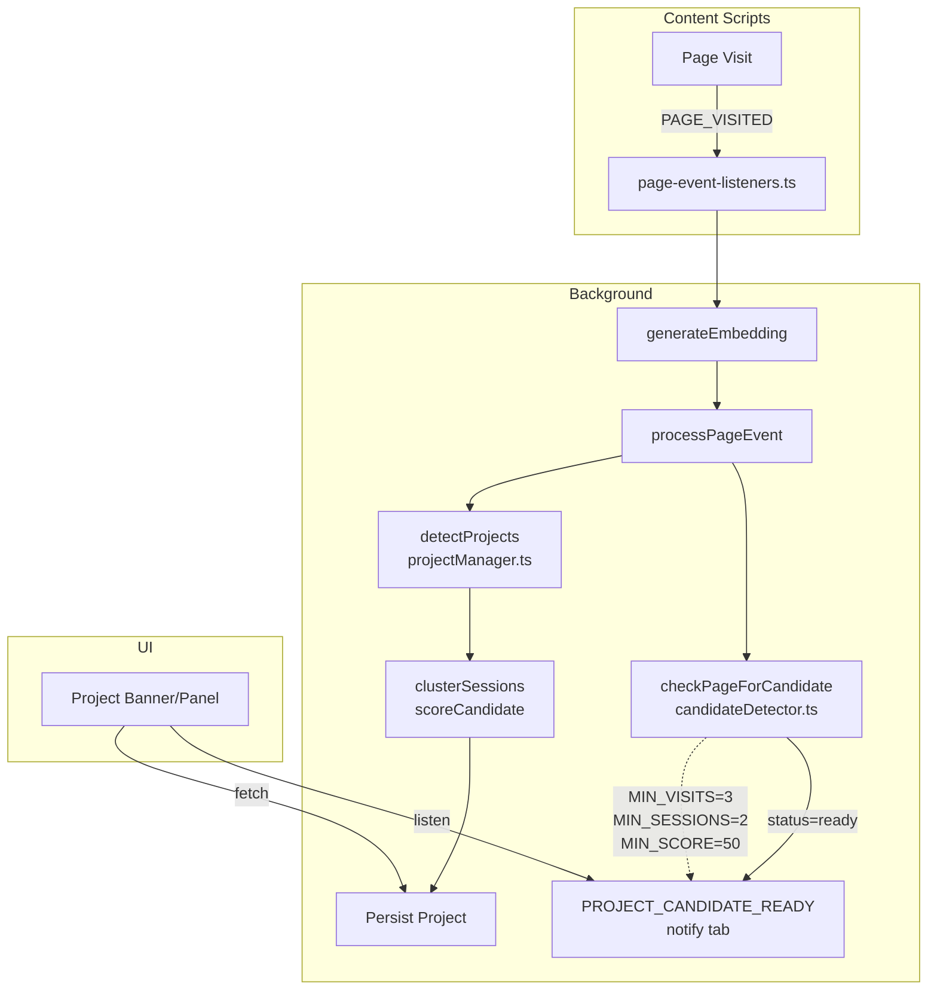

# Prism Base App: Architecture & Flow Diagrams

---

## 1. Layered Search Fallback (Layer1 → Layer2 → Layer3)

```mermaid
%% Embedding model: Xenova/all-MiniLM-L6-v2 (background, ONNX, embedding-engine.ts)
%% Layer 2: TF-IDF + cosine similarity (layer2-semantic-search.ts)
%% Layer 1: Keyword density scoring (layer1-keyword-search.ts)
%% Fallback: ML → Semantic → Keyword, based on result emptiness or error
%% Thresholds: ML sim > 0.6, Semantic sim > 0.3
flowchart TD
    subgraph UI/Content
        A[User Query]
        A -->|SEARCH_QUERY| B
    end
    subgraph Background
        B[SEARCH_QUERY handler\nbackground/index.ts]
        B --> C[executeSearch\nsearch-coordinator.ts]
        C --> D1[searchWithML\nlayer3-ml-ranker.ts]
        D1 -- "ML results?\n(sim > 0.3)" -->|Yes| E1[Return ML Results]
        D1 -- "No/Fail" --> D2[searchSemantic\nlayer2-semantic-search.ts]
        D2 -- "Semantic results?\n(sim > 0.1)" -->|Yes| E2[Return Semantic Results]
        D2 -- "No/Fail" --> D3[searchByKeywords\nlayer1-keyword-search.ts]
        D3 --> E3[Return Keyword Results]
    end
    style D1 fill:#e0f7fa,stroke:#00796b
    style D2 fill:#fff9c4,stroke:#fbc02d
    style D3 fill:#ffe0b2,stroke:#e65100
    classDef fallback fill:#f8bbd0,stroke:#c2185b
    E1:::fallback
    E2:::fallback
    E3:::fallback
    %% Thresholds
    D1 -.->|"sim > 0.6"| E1
    D2 -.->|"sim > 0.3"| E2
```

---

## 2. Knowledge Graph Construction & Query



---

## 3. Timeline Clustering & Sessionization

```mermaid
%% Sessionization: 30min gap, 2hr max, 15s context switch (sessionManager.ts)
%% Session title: domain cluster → keyword extraction → fallback (session-title-inference.ts)
%% Embeddings: Xenova/all-MiniLM-L6-v2 (background)
%% Timeline clusters: Louvain clustering on page graph (knowledge-graph.ts)
%% Storage: Sessions in IndexedDB (sessionStore.ts)
flowchart TD
    subgraph Content Scripts
        A[Page Visit]
        A -->|PAGE_VISITED| B
    end
    subgraph Background
        B[page-event-listeners.ts]
        B --> C[generateEmbedding]
        C --> D[processPageEvent\nsessionManager.ts]
        D --> E[saveSessions\nsessionStore.ts]
        D --> F[inferSessionTitle\nsession-title-inference.ts]
        D --> G[markGraphForRebuild]
        G --> H[buildKnowledgeGraph\n(page clusters)]
    end
    subgraph UI
        I[Timeline View]
        I -->|fetch sessions/clusters| E
        I -->|fetch clusters| H
    end
    %% Thresholds
    D -.->|"SESSION_GAP=30min\nMAX_DURATION=2hr\nCONTEXT_SWITCH=15s"| E
```

---

## 4. Project Detection (Real-time & Batch)



---

## 5. Whole Project Flow

```mermaid
%% Embedding model: Xenova/all-MiniLM-L6-v2 (ONNX, background only)
%% Clustering: Louvain (knowledge-graph.ts)
%% Storage: Sessions (IndexedDB), Projects/Labels/Candidates (chrome.storage.local), Graph (in-memory)
%% Messaging: chrome.runtime.sendMessage, chrome.tabs.sendMessage
%% UI: React 18 (Plasmo), content scripts inject anchors and send PAGE_VISITED, etc.
flowchart TD
    %% UI/Content Scripts
    subgraph UI/Content
        A1[Popup]
        A2[Sidepanel]
        A3[Indicator Content Script]
        A4[Page-Capture Content Script]
        A1 -- "OPEN_SIDEPANEL, SEARCH_QUERY" --> B[Message Router\nbackground/index.ts]
        A2 -- "FETCH_SESSIONS, FETCH_GRAPH, FETCH_PROJECTS" --> B
        A3 -- "CONTENT_SCRIPT_READY, PAGE_VISITED, ACTIONS" --> B
        A4 -- "PAGE_VISITED (with metadata)" --> B
    end

    %% Background Service Worker
    subgraph Background
        B[Message Router\nbackground/index.ts]
        B -- "processPageEvent" --> C1[sessionManager]
        B -- "generateEmbedding" --> C2[embedding-engine]
        B -- "checkPageForCandidate" --> C3[candidateDetector]
        B -- "detectProjects, persist/load" --> C4[projectManager]
        B -- "executeSearch" --> C5[search-coordinator]
        B -- "rebuildGraphIfNeeded, buildKnowledgeGraph" --> C6[knowledge-graph]
        C1 -- "saveSessions/loadSessions" --> D1[sessionStore\nIndexedDB]
        C4 -- "save/load projects" --> D2[chrome.storage.local]
        C3 -- "save/load candidates" --> D2
        C6 -- "update graph state" --> D3[Graph State\nIn-memory]
        B -- "PROJECT_CANDIDATE_READY, PROJECT_MAIN_SITE_VISIT, COI_ALERT, OPEN_SIDEPANEL" --> E[chrome.tabs.sendMessage]
    end

    %% Storage
    subgraph Storage
        D1[IndexedDB: Sessions]
        D2[chrome.storage: Projects/Labels/Candidates]
        D3[In-memory: Graph]
    end

    %% UI receives notifications and fetches data
    subgraph UI/Content
        E -- "Show Banner/Panel, Open Sidepanel, Show Alert" --> A1
        E -- "Show Banner/Panel, Open Sidepanel, Show Alert" --> A2
        E -- "Show Banner/Panel, Open Sidepanel, Show Alert" --> A3
    end

    %% Notes
    %% - Message types: SEARCH_QUERY, PAGE_VISITED, FETCH_SESSIONS, FETCH_GRAPH, FETCH_PROJECTS, OPEN_SIDEPANEL, PROJECT_CANDIDATE_READY, etc.
    %% - Data persistence: Sessions (IndexedDB), Projects/Labels/Candidates (chrome.storage), Graph (in-memory)
    %% - Each background module is invoked by the router based on message type
```



---

> Each diagram above is separated by a divider and includes inline threshold/heuristic labels where relevant. See referenced file names for implementation details.
